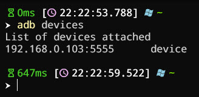

## Prerequisites

It's expected that you've already completed the steps described in **[Prepare Workstation](./00-prepare-workstation.md)** and **[Prepare Device](./01-prepare-device.md)**. Apart from the prerequisites described in that articles, you may need the next items for autotest:
- installed Node.js
- installed Appium server
- you have any functional test to run (manual or automated)
- you have `curl` available in your CLI

### Run performance test

0. Make sure you've completed all the **[Prerequisites](#prerequisites)**
1. Get the name (or IP address) of the phone device with the help of adb:

    ``` bash
    adb devices
    ```

    
2. You have to know the native app name as it's going to use as a parameter for PMetrium Native endpoint. For example, `com.parimatch.ukraine` in our case. You may ask your developers to help you with this

3. Start performance metrics measurement:

    ```bash
    curl -G -d "device=192.168.0.103:5555" -d "app=com.parimatch.ukraine" http://localhost:7777/Start
    ```

    where: `device` and `app` are two **required** parameters for the request
    
    :::tip
    Read more about **[PMetrium Native Api](../architecture/03-development/04-pmetrium-api.md)**
    :::

4. Run functional test, for example (This test is not present in GitHub repository, replace this line with your own or perform manual test):

    ```bash
    dotnet test .\src\PMetrium.Native\FunctionalTests --filter ColdStart
    ```

5. Once the functional test is over you have to run the next command in order to stop measurement:

    ```bash
    curl -G -d "device=192.168.0.103:5555" http://localhost:7777/Stop
    ```

    where: `device` is the **required** parameter for the request

    :::tip
    All three commands may be organized into bat or shell script not to be called manually, for example, bat file:

    ```bash title=demo.bat
    curl -G -d "device=192.168.0.103:5555" -d "app=com.parimatch.ukraine" http://localhost:7777/Start

    dotnet test .\src\PMetrium.Native\FunctionalTests  --filter ColdStart

    curl -G -d "device=192.168.0.103:5555" http://localhost:7777/Stop
    ```
    :::

6. Open grafana in the browser: `http://localhost:3000` and check the results, you should see something like this:

    :::caution attention
    Grafana credentials:
    - Login: **admin**
    - Password: **admin**
    :::

    

#### Run from code
Using `CURL` is not a requirement. You can just integrate the interaction with the PMetrium Native server into your functional tests framework. Let's look at the example of such functional autotest for native application on C# (programming language here does not matter):

```csharp
using System;
using System.Collections.Generic;
using System.Net.Http;
using System.Threading;
using System.Threading.Tasks;
using FunctionalTests.Helpers;
using Microsoft.AspNetCore.WebUtilities;
using NUnit.Framework;
using OpenQA.Selenium;

namespace FunctionalTests;

public class AndroidTests
{
    private HttpClient _httpClient;

    [OneTimeSetUp]
    public void OneTimeSetUp()
    {
        AppiumFacade.StartAppiumServer();
        _httpClient = new HttpClient();
    }

    [SetUp]
    public async Task SetUp()
    {
        var query = new Dictionary<string, string>()
        {
            ["device"] = "192.168.0.103:5555",
            ["app"] = "com.parimatch.ukraine"
        };

        var uri = QueryHelpers.AddQueryString("http://localhost:7777/Start", query);
        await _httpClient.GetAsync(uri);
    }

    [TearDown]
    public async Task TearDown()
    {
        var query = new Dictionary<string, string>()
        {
            ["device"] = "192.168.0.103:5555",
        };

        var uri = QueryHelpers.AddQueryString("http://localhost:7777/Stop", query);
        await _httpClient.GetAsync(uri);
    }

    [Test]
    public async Task MyAwesomeTest()
    {
        var driver = AppiumFacade.ProvideAndroidDriver();

        // you code for functional test
        // ...
        // ...

        driver.Quit();
    }
}
```

So all the communication is done throught `HttpClient` and the NUnit abilities with `[SetUp]` and `[TearDown]`